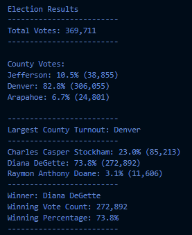

# Election_Analysis

## Project Overview
A Colorado Board of Elections employeee has given you the following task to complete the election audit of a recent local congressional election:

1. Calculate the total number of votes cast.
2. Get a complete list of candidates who received votes.
3. Calculate the total number of votes each candidate received.
4. Calculate the percentage of votes each candidate won.
5. Determine the winner of the election based on popular vote.
6. The voter turnout for each county.
7. The percentage of votes from each county out of the total count.
8. The county with the highest turnout.

## Resources
- Data Source: election_results.csv
- Software: Python 3.9.5, Visual Studio Code, 1.58.0

## Summary (Election - Audit Results)
The analysis of the election show that:
- There were 369,711 votes cast in the election.
- There were three different counties:
  - Jefferson
  - Denver
  - Arapahoe
- The counties results were:
  - The vote turnout of the county "Jefferson" was "10.5%" of the total of votes with "38,855" number of votes.
  - The vote turnout of the county "Denver" was "82.8%" of the total of votes with "306,055" number of votes.
  - The vote turnout of the county "Arapahoe" was "6.7%" of the total of votes with "24,801" number of votes.
- The county with the largest vote turnout was:
  - **Denver** with an **"82.8%"** of the total of votes and with **"306,055"** votes.
- The candidates were:
  - Charles Casper Stockham
  - Diana DeGette
  - Raymon Anthony Doane
- The candidate results were:
  - Charles Casper Stockham received "23%" of the vote total with "85,213" number of votes.
  - Diana DeGette received "73.8%" of the vote total with "272,892" number of votes.
  - Raymon Anthony Doane received "3.1%" of the vote total with "11,606" number of votes.
 - The winner of the election was:
  - **Diana DeGette**, who dominated the election with a **"73.8%"** of the vote total and **"272,892"** number of votes.

The results of this analysis was written and stored in a txt file and its shown in the image below.

### Election - Audit Results

 

### Challenge Overview.
In order to solve the vote turnout for each county, the following code was implemented:

1. Creating a county list and county dictionaries.
  
        county_options = []
        candidate_counties = {}
2. Track the largest county and county voter turnout with the next variables.

         largest_county = ""
         counties_count = 0
         counties_percentage = 0
 
3. Open and read the csv file and convert it into a list of dictionaries:

        with open(file_to_load) as election_data:
         reader = csv.reader(election_data)

         # Read the header
          header = next(reader)

          # For each row in the CSV file.
              for row in reader:

          # Add to the total vote count
            total_votes = total_votes + 1

          # Get the candidate name from each row.
            candidate_name = row[2]

4. Extract the county name from each row.

        # 3: Extract the county name from each row.
          county_names = row[1]
          
5. Writing an if statement that checks that the county_name does not match any existing county in the county list.
        
        if county_names not in county_options:

            # 4b: Add the existing county to the list of counties.
            county_options.append(county_names)

            # 4c: Begin tracking the county's vote count.
            candidate_counties[county_names] = 0

        # 5: Add a vote to that county's vote count.
        candidate_counties[county_names] += 1
        
        county_names = row[1]
        
 6. Open the txt file with writing mode "w".

        with open(file_to_save, "w") as txt_file:
        
 7. Writing for loops to get county information from the county dictionary.
     
     
        for county_names in candidate_counties:
            # 6b: Retrieve the county vote count.
            county_count = candidate_counties.get(county_names)
            # 6c: Calculate the percentage of votes for the county.
            county_percentage = (float(county_count) / float(total_votes)) * 100

             # 6d: Print the county results to the terminal.
            county_results = f"{county_names}: {county_percentage:.1f}% ({county_count:,})\n"
            print(county_results)
             # 6e: Save the county votes to a text file.
            txt_file.write(county_results)
8. Writing an if statement to determine the winning county and get its vote count.

            if (county_count > counties_count) and (county_percentage > counties_percentage):
                largest_county = county_names
                counties_count = county_count
                counties_percentage = county_percentage
                
9. Printing the county with the largest turnout to the terminal.
    
        counties_turnout = (
            f"\n-------------------------\n"
            f"Largest County Turnout: {largest_county}"
            f"\n-------------------------\n"
        )
        print(counties_turnout)
    
  10. Saving the county analysis results to a text file.
    
    txt_file.write(counties_turnout)

## Election - Audit Summary
In this challenge we were asked to analyse the ***"election_results.csv"*** and use Python skills, like dictionaries, tuples, lists and loops in order to determine the relevant insights of the local congressional election. This could be useful election commission because this is a way to automatize the process and make it more efficient and fast. Some additions that could be made to the code could be to adapt the variables to display the results of the State elections or even on the federal level, it could also have more columns with extra information of the population, like age, sex or ethnicity that could be helpful for population analysis. Also the code coul be modified to get what percentage of votes each county had for certain candidate adding an extra if statement with the **candidate_name** variable.
